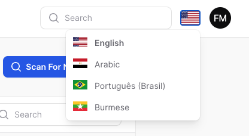

# Filament translations

Manage your translation with DB and cache, you can scan your languages tags like `trans()`, `__()`, and get the string inside and translate them use UI.

this plugin is build in [spatie/laravel-translation-loader](https://github.com/spatie/laravel-translation-loader)

## Screenshots





## Installation

```bash
composer require tomatophp/filament-translations
```

## Publish Resource

you can publish the resource to your project

```bash
php artisan vendor:publish --tag="filament-translations-migrations"
```

if you need to publish config

```bash
php artisan vendor:publish --tag="filament-translations-config"
```

Run migration:

```bash
php artisan migrate
```

and now clear cache

```bash
php artisan optimize:clear
```

finally reigster the plugin on `/app/Providers/Filament/AdminPanelProvider.php`

```php
$panel->plugin(\TomatoPHP\FilamentTranslations\FilamentTranslationsPlugin::make())
```


## Publish Assets

you can publish config file by use this command

```bash
php artisan vendor:publish --tag="filament-translations-config"
```

you can publish views file by use this command

```bash
php artisan vendor:publish --tag="filament-translations-views"
```

you can publish languages file by use this command

```bash
php artisan vendor:publish --tag="filament-translations-lang"
```

you can publish migrations file by use this command

```bash
php artisan vendor:publish --tag="filament-translations-migrations"
```

## Support

you can join our discord server to get support [TomatoPHP](https://discord.gg/Xqmt35Uh)

## Docs

you can check docs of this package on [Docs](https://docs.tomatophp.com/plugins/laravel-package-generator)

## Changelog

Please see [CHANGELOG](CHANGELOG.md) for more information on what has changed recently.

## Security

Please see [SECURITY](SECURITY.md) for more information about security.

## Credits

- [Tomatophp](mailto:info@3x1.io)

## License

The MIT License (MIT). Please see [License File](LICENSE.md) for more information.
