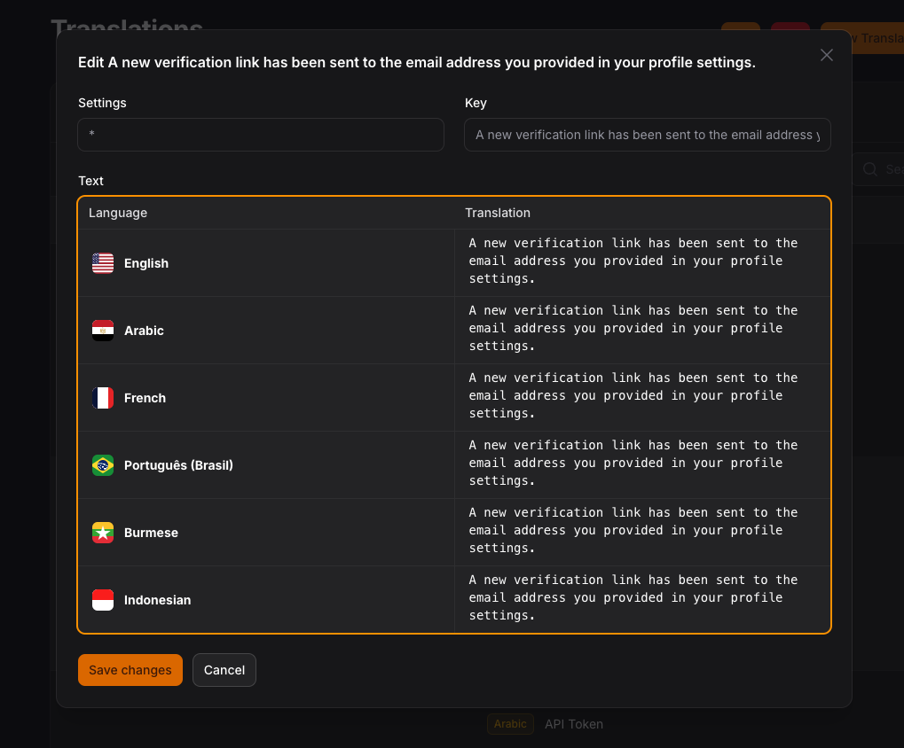

# Filament translations

Manage your translation with DB and cache, you can scan your languages tags like `trans()`, `__()`, and get the string inside and translate them use UI.

this plugin is build in [spatie/laravel-translation-loader](https://github.com/spatie/laravel-translation-loader)

## Screenshots





## Installation

```bash
composer require tomatophp/filament-translations
```
after install your package please run this command

```bash
php artisan filament-translations:install
```

Run migration:

```bash
php artisan vendor:publish --tag="filament-translations-migrations"
php artisan vendor:publish --tag="filament-translations-config"
php artisan migrate
```

In `config/app.php` (Laravel) or `bootstrap/app.php` (Lumen) you should replace Laravel's translation service provider

```php
Illuminate\Translation\TranslationServiceProvider::class,
```

by the one included in this package:

```php
Spatie\TranslationLoader\TranslationServiceProvider::class,
```

## Add Language Middleware

go to app/Http/Kernel.php and add new middleware to $middlewareGroups

```php
    'web' => [
        //...
        \TomatoPHP\FilamentTranslations\Http\Middleware\LanguageMiddleware::class,
    ],
```

go to config/filament.php and add middleware to middleware auth array

```php
    'middleware' => [
        'auth' => [
            //...
            \TomatoPHP\FilamentTranslations\Http\Middleware\LanguageMiddleware::class
        ],
        //...
    ];
```

and now clear cache

```bash
php artisan optimize:clear
```

finally reigster the plugin on `/App/Providers/Filament/AdminPanelProvider.php`

```php
$panel->plugin(\TomatoPHP\FilamentTranslations\FilamentTranslationsPlugin::make())
```


## Publish Assets

you can publish config file by use this command

```bash
php artisan vendor:publish --tag="filament-translations-config"
```

you can publish views file by use this command

```bash
php artisan vendor:publish --tag="filament-translations-views"
```

you can publish languages file by use this command

```bash
php artisan vendor:publish --tag="filament-translations-lang"
```

you can publish migrations file by use this command

```bash
php artisan vendor:publish --tag="filament-translations-migrations"
```

## Support

you can join our discord server to get support [TomatoPHP](https://discord.gg/Xqmt35Uh)

## Docs

you can check docs of this package on [Docs](https://docs.tomatophp.com/plugins/laravel-package-generator)

## Changelog

Please see [CHANGELOG](CHANGELOG.md) for more information on what has changed recently.

## Security

Please see [SECURITY](SECURITY.md) for more information about security.

## Credits

- [Tomatophp](mailto:info@3x1.io)

## License

The MIT License (MIT). Please see [License File](LICENSE.md) for more information.
